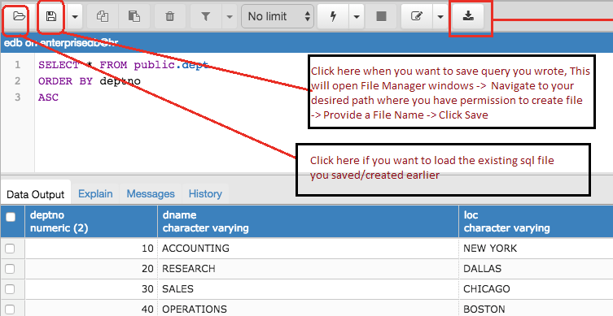

###How to push your work to Github ?

- Save the queries into a sql file (.sql extension) and push this file to Github.
- To save the file into an sql file, click on the “Save” button : the instructions are in the image below

---

###Exercise 1: Items and customers

1. Create a database called public.
2. Add two tables:
   - items
   - customers.

**Follow the instructions below to determine which columns and data types to add to the two tables:**

1. Add the following items to the items table:
   - 1 - Small Desk – 100 (ie. price)
   - 2 - Large desk – 300
   - 3 - Fan – 80

2. Add 5 new customers to the customers table:
   - 1 - Greg - Jones
   - 2 - Sandra - Jones
   - 3 - Scott - Scott
   - 4 - Trevor - Green
   - 5 - Melanie - Johnson

3. Use SQL to fetch the following data from the database:
   1. All the items.
   2. All the items with a price above 80 (80 not included).
   3. All the items with a price below 300. (300 included)
   4. All customers whose last name is ‘Smith’ (What will be your outcome?).
   5. All customers whose last name is ‘Jones’.
   6. All customers whose firstname is not ‘Scott’.

