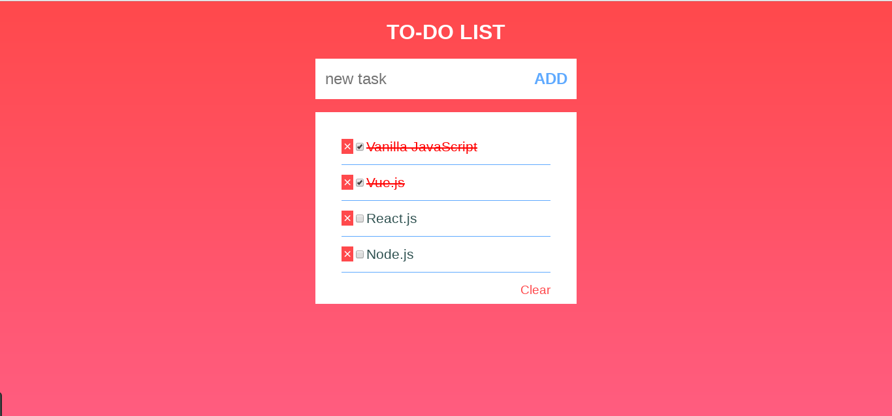

###Useful Resources

For more info on SqlAlchemy, take a look at the [documentation](https://flask-sqlalchemy.palletsprojects.com/en/2.x/queries/)

###PART I

1. Create a new directory for this project.

2. Create an __init__.py file and use app.config to configure the Database. Let’s call our database schedule.

3. Create a file called models.py:
   1. Use SQLAchemy to create a model called Todo. This model should have two columns :
      - id : which is a primary key
      - details : which is the task itself (a Text Type)

   2. the Todo model, add a method:
      1. save_task_to_db(self): this method should save the new todo to your table (ie. new record).
   3. After your model is complete, use Flask Migrate to create your database.

4. Create a forms.py file with a new form named “AddTodo”. The form should contain:
   1. An input to add a todo. This input is required.
   2. A button to submit the form.
   
5. Create a templates folder. In the folder add a file called index.html. The index.html template should contain the form created above and the list of all the existing todos.

###PART II

1. Create a file routes.py, and add a new route:
   - Route /
     - If the form is submitted and there are no errors, the new todo should be added to the table (ie. call the save_task_to_db method). Make sure to redirect the users to the / route.
     
     - else, call the get_tasks method and return the index.html template.

###PART III

1. In the models.py file
   1. Add an completed column to the Todo model. This column will contain a Boolean (True or False). By default, this column should be False. Use Flask Migrate to add this new column to the table.
   
   2. Add a method called set_task_as_complete(self). This method will retrieve the todo from the table, and change the completed column from False to True.

2. In the routes.py file, create a new route named complete/\<int:todo_id>: this route will allow the user to check a todo as complete(ie. call the set_task_as_complete method)

3. In the index.html file, add a CHECK button next to each todo. This button is linked to the complete/\<int:todo_id> route, where todo_id is the id of the task we want to complete.

4. When a task is completed redirect the user to the / route. In the template index.html, if a task is completed, change the color from black to red.

###Bonus: PART IV - Not Mandatory

1. Add a “Clear All” button that when clicked, deletes all the todos from the table (ie. delete all records). This is advanced, so you need to check out the documentation and Stack Overflow for help.

2. Add a “X” button next to each todo, that when clicked, deletes a specific todo from the table.
