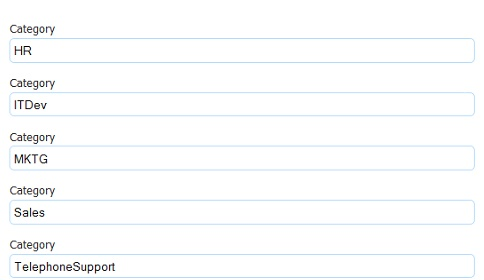

###Useful Resources

For more info on SqlAlchemy, take a look at the [documentation](https://flask-sqlalchemy.palletsprojects.com/en/2.x/queries/)

## Basic part

###PART I

1. Create a new directory for this project.

2. Create an __init__.py file and use app.config to configure the Database. Let’s call our database schedule.

3. Create a file called models.py:
   1. Use SQLAchemy to create a model called Todo. This model should have two columns :
      - id : which is a primary key
      - details : which is the task itself (a Text Type)

   2. the Todo model, add a method:
      1. save_task_to_db(self): this method should save the new todo to your table (ie. new record).
   3. After your model is complete, use Flask Migrate to create your database.

4. Create a forms.py file with a new form named “AddTodo”. The form should contain:
   1. An input to add a todo. This input is required.
   2. A button to submit the form.
   
5. Create a templates folder. In the folder add a file called index.html. The index.html template should contain the form created above and the list of all the existing todos.

###PART II

1. Create a file routes.py, and add a new route:
   - Route /
     - If the form is submitted and there are no errors, the new todo should be added to the table (ie. call the save_task_to_db method). Make sure to redirect the users to the / route.
     
     - else, call the get_tasks method and return the index.html template.

###PART III

1. In the models.py file
   1. Add an completed column to the Todo model. This column will contain a Boolean (True or False). By default, this column should be False. Use Flask Migrate to add this new column to the table.
   
   2. Add a method called set_task_as_complete(self). This method will retrieve the todo from the table, and change the completed column from False to True.

2. In the routes.py file, create a new route named complete/\<int:todo_id>: this route will allow the user to check a todo as complete(ie. call the set_task_as_complete method)

3. In the index.html file, add a CHECK button next to each todo. This button is linked to the complete/\<int:todo_id> route, where todo_id is the id of the task we want to complete.

4. When a task is completed redirect the user to the / route. In the template index.html, if a task is completed, change the color from black to red.

###Bonus: PART IV - Not Mandatory

1. Add a “Clear All” button that when clicked, deletes all the todos from the table (ie. delete all records). This is advanced, so you need to check out the documentation and Stack Overflow for help.

2. Add a “X” button next to each todo, that when clicked, deletes a specific todo from the table.

## Advanced part

##Instructions:

Today, we will continue building the To Do List Mini Project. We will add some relationships to our models to make the project more userfriendly.
So open your project in your code editor, and let’s start :)

##Part I

1. In models.py :
    1. Add a “image” field to the Todo model. The model should look as follows:
        - id : a Primary key
        - details : a Text Type
        - image : a relationship with the Image model (see below). Don’t forget to add a backref.

    2. Create a new model called Image with the following fields:
    - id : a Primary key
    - url : a String Type
    - todo_id : a Foreign key to todo.id

   The Todo model has a one to one relationship with the Image Model : a todo can only have one image, and an image belongs to only one todo. Check out these videos on [One-To-One Relationships using Flask and SqlAchemy](https://www.youtube.com/watch?v=JI76IvF9Lwg) and [this tutorial](https://www.kite.com/python/examples/4731/sqlalchemy-add-a-bidirectional-one-to-one-relationship-between-classes).

   3. From now on, to create a new todo, the user needs to enter the details of the task and the image representing that task (a URL). Therefore, we should modify the save_task_to_db(self) method accordingly. The steps should be:
      - save the image URL to the image table.
      - save the todo to the todo table
      - then, assign the new image object to the new todo object.

2. In the forms.py, add a new string field to the “AddTodo” form. The form should now have : two inputs text (one for the todo, the second one for the image URL) and one submit button. The two inputs should be required.

3. In the index.html file, render the todos with their image. Make it pretty! You can use the Bootstrap Card class.

###Part II: Not Mandatory

1. In models.py :
   1. Add a “categories” field to the Todo model. The Todo model should look like this:
       - id : a Primary key
       - details : a Text Type
       - image : a relationship with the Image model.
       - categories : a bidirectional relationship with the Category model (ie. the todos column) - (see below)
        
   2. Create a new model called Category with the following columns:
      - id : a Primary Key
      - name : a String
      - todos : a bidirectional relationship with the Category model (ie. the categories column)
       
      The Todo model has a many to many relationship with the Category Model : a todo can have multiple categories (ie. Work,Sport,Home), and a category can belong to many todos. Check out this video on [Many-To-Many Relationships using Flask and SqlAchemy](https://www.youtube.com/watch?v=OvhoYbjtiKc).

   3. Create an association table with two columns: “todo_id” and “category_id”

2. Use Flask Migrate to add all this new information to the database

3. In the forms.py file, create a new form called “AddCategory” (containing an input text) and use FieldList to link this new form to the “AddTodo” form. The minimum entries for the “AddCategory” form should be 4 (ie. it means that a user can add a maximum of 4 categories per todo). Check out [the documentation](http://wtforms.simplecodes.com/docs/0.6.1/fields.html#wtforms.fields.FieldList) and [this video on FieldList](https://www.youtube.com/watch?v=DqumX6deRR8) for help.

Here are the category inputs that you should display (after the todo inputs and image URL).
This image is an example. The categories in our project should be “Work”, or “Sport” or “Home” ect … 

4. Bonus : The “AddCategory” form contains an input text that the user must fill. To make our project more userfriendly, try to use [SelectField](http://wtforms.simplecodes.com/docs/0.6.1/fields.html#wtforms.fields.SelectField).

5. Change the methods in the Todo model (in the models.py file) accordingly.

6. Change the index.html file. To display the categories next to each todo, use FontAwesome - each category should be represented by a different icon.