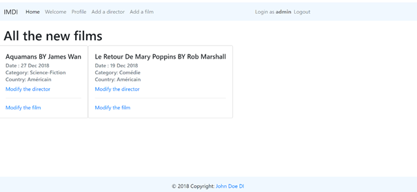
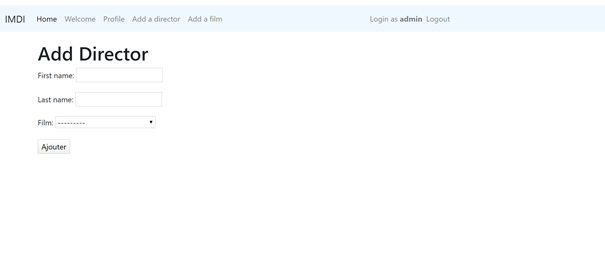
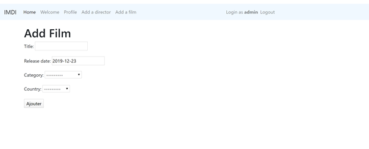

### IMDB for DevelopersInstitute

---

### PART 1

1. Create a new folder called “FilmProject”, and install flask.
2. Create an app directory that contains two apps : “films” and “accounts”. Today we will work on the “films” app.

---

### PART A : Create a film app, called films

1. Create a route /homepage, that renders the template homepage.html
2. In the folder templates, add a new folder called partials, and add inside 2 HTML files:
   1. base.html : that contains the Bootstrap CDN link and the title tag, as well as a Bootstrap footer.
   2. navbar.html : that contains a Boostrap navbar.
3. In homepage.html, extend the base.html template and include the file navbar.html.  
Hint: [Check out the Documentation](https://jinja.palletsprojects.com/en/2.11.x/templates/#include) to understand how to include templates

---

### PART B: films : Add a film and a director

1. Create 4 new models:
   1. Country :
      - name
   2. Category :
      - name
   3. Film:
      - title
      - release_date (default the date of today)
      - created_in_country : One to Many relationship with Country (the “nationality of the film”)
      - available_in_countries : Many to Many relationship with Country
      - category: Many to Many relationship with Category
      - director : Many to Many relationship with Director
   4. Director:
      - first_name
      - last_name

2. Create the forms : *AddFilmForm* and *AddDirectorForm*
3. Create the routes : *addFilm* and *addDirector*
4. Create the functions : *addFilm* and *addDirector*
5. In templates, create a folder *director* with the file *addDirector.html*
6. In templates, create a folder *film* with the file *addFilm.html*
7. The new films with their director(s) have to be rendered on the template *homepage.html*. You can use the component card of Bootstrap to style the page.
8. Be careful, the date has to be in “human friendly” format.
9. In the navbar you should add 2 new links to the routes *addFilm* and *addDirector*

---

Example of how it should look, you can of course, add your own style
For now, use some dummy data to display the user’s name in the navbar. On DAY4 we will use authentication

*http://127.0.0.1:8000/films/homepage/*!

---

*http://127.0.0.1:8000/films/addDirector/*

---

*http://127.0.0.1:8000/films/addFilm/*

